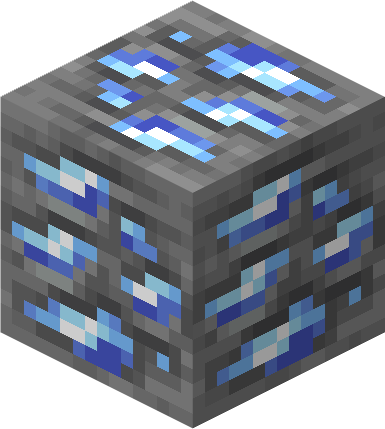

# Cobalt

Cobalt **ore** is a [mineral](https://minecraft.wiki/w/Mineral) block that drops raw cobalt when mined.

Deepslate cobalt ore is a variant of cobalt ore that rarely generates at the top of the [deepslate](https://minecraft.wiki/w/Deepslate) layer.

| Stackable              | Yes (64)      |
|------------------------|---------------|
| Tool                   | Diamond >     |
| Blast Resistance       | 3             |
| Hardness               | Cobalt Ore: 3 | Deepslate Cobalt Ore 4.5 |
| Luminous               | No            |
| Transparent            | No            |
| Flammable              | No            |
| Renewable              | No            |
| **Natural generation** | 6             | -64 |