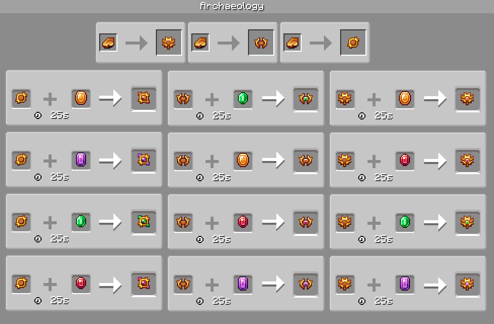

# Relic Gold

Relic gold is an artifact gathered from archaeology.

Used mostly to craft accessories.

| Stackable              | Yes (64)                  |
|------------------------|---------------------------|
| Tool                   | Pick                      |
| Flammable              | Yes                       |
| Renewable              | No                        |
| **Natural generation** | Suspicious types of stone |

